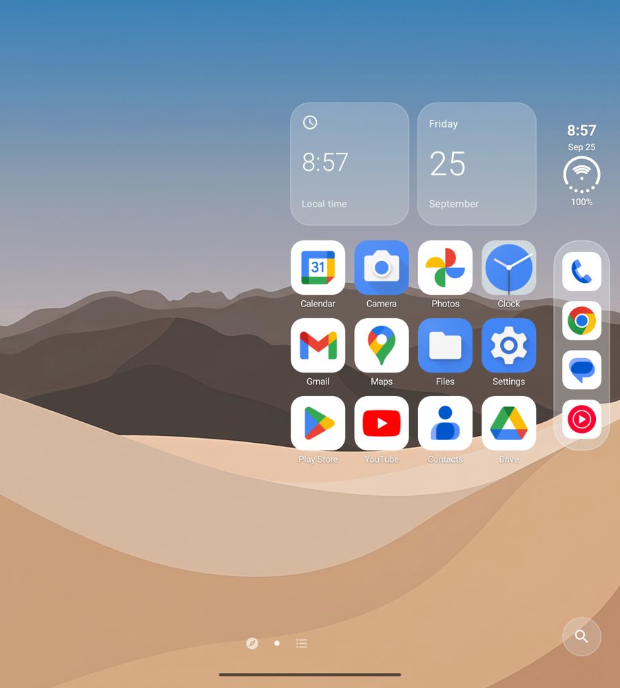
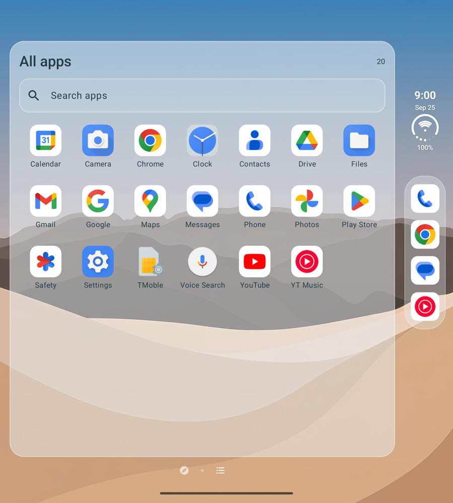
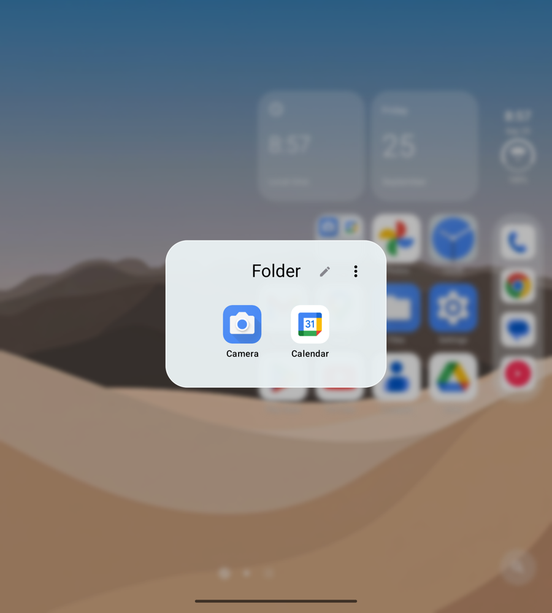

# iDuo Launcher

A native Android launcher built around a right-side dock and a home screen that makes room when you unfold your phone.

**Version 1.0.0 · Android 12 or later.** Built and tested on the Galaxy Z Fold 7 (cover and inner displays) and a matching emulator. Google Discover depends on the installed Google app and device support for activity embedding; an RSS reader is available as an alternative left page.

<p>
  
  
  
</p>

**Start here:** [User guide](docs/user-guide.md) · [Troubleshooting](docs/troubleshooting.md) · [Release notes](docs/releases/1.0.0.md) · [Privacy policy](docs/privacy-policy.md)

## Features

- A persistent right-side dock and vertical Home status indicators.
- Overlapping unfolded page pairs: an extra workspace beside Home 1, then Home 1 beside Home 2, and so on.
- Android widgets, visual widget selection, resizing, native scrolling, and drag-and-drop between pages.
- App dragging, pages created during an edge drag, Home folders made by dropping one app onto another, and separate personal/work catalogs where device policy permits.
- All apps as an alphabetical list or a paged grid, Google search with a local app-search fallback, and a left page with live Google Discover or a built-in RSS reader.
- A 4 × 4, 4 × 5 or 4 × 6 Home grid and four to eight dock apps.
- Android's own wallpaper on Home, set from a photo or the bundled dunes; light/dark/system or sunrise/sunset appearance; and layout export/import.
- English, Czech, Slovak, Polish, and German, following the system language or chosen in **Language**.

Android still controls the lock screen, notification panels, recents, and system app transitions.

## Install and try it

1. Install iDuo Launcher from Google Play, or download the signed APK from this repository's Releases section.
2. Open the APK, allow installation from that source if Android asks, and open **iDuo Launcher**.
3. Try the layout before choosing **Set as home app**. Select iDuo Launcher in Android's Home app settings when ready.
4. Long press any empty Home space, including the wallpaper around and below the grid, to add widgets or **Customize launcher**. Help is available from customization.

To switch back, open Android **Settings → Apps → Default apps → Home app** and select your previous launcher. Vendor labels may differ. Installing iDuo does not automatically select it as Home.

Updates install over the existing app when they are signed with the same key. Uninstalling or clearing storage removes the saved layout and widget bindings, so export a layout backup first. A differently signed developer/debug build cannot be updated directly by the public APK; see [release and update notes](docs/public-release.md).

## Everyday controls

| Action | Gesture or control |
| --- | --- |
| Change pages | Swipe horizontally across Home, the dock, or right rail; one page per gesture |
| All apps | Swipe past the last Home page or tap its page control |
| Discover | Swipe right from the first Home page or tap the compass |
| Return from Discover | Swipe left, use the right-pointing arrow, or press Back |
| Rearrange apps/widgets | Hold, then drag; pause at the screen edge to change or create a page |
| Add to the dock | Drag into a vacancy; move an app out first when the dock is full |
| Scroll a widget | Swipe vertically inside its content; hold still to pick it up |
| Customize | Long press any empty Home space or bare wallpaper |
| Notifications / Quick Settings | Swipe down from Home's left 70% / right 30%, after enabling optional shade gestures |

The surrounding status ring shows battery, the inner arcs show Wi-Fi strength, and the lower dots show cellular strength. Unknown readings are not displayed as full signal. This rail applies to Home only.

## Optional access and privacy

No launcher account, server, advertising, analytics, or automatic crash-upload service is used. Layouts stay on the device unless explicitly exported or shared. The app connects to the internet only for the optional RSS reader, directly to the sources you add.

- **Widgets:** Android asks to allow binding; providers may have their own setup.
- **Shade gestures:** the optional accessibility service opens notifications and Quick Settings. It cannot read window contents or inject gestures.
- **Sunrise/sunset:** manually enter coordinates or explicitly request approximate location. There is no background location request.
- **Photos:** the system picker grants access to chosen images, without whole-library access.
- **Google features:** the installed Google app's account, network, and privacy settings apply.

Read [data and permissions](PRIVACY.md) before sharing backups or diagnostics.

## Known limits

- Discover can differ across Google, Android, and vendor updates. Its smooth embedding transition includes a version-scoped compatibility workaround; it is not a portable SystemUI API. Recovery controls let you return Home when unavailable.
- Work apps/widgets remain subject to administrator policy. Private Space is not supported.
- Icon packs and notification dots are not implemented. Folders cannot nest or occupy dock slots.
- Imported Android widgets require binding again. Cross-installation work entries may require manual placement. Backups exclude photo backgrounds and system widget capabilities.
- Secure lock-screen replacement and hinge-driven cross-display animation are not part of the launcher.

## Build

Use JDK 17 or Android Studio's bundled JDK, Android SDK 36, and the included Gradle wrapper. Set `ANDROID_HOME` or a local `sdk.dir` in `local.properties`.

```sh
./scripts/gradle.sh :app:assembleDebug :app:testDebugUnitTest :app:lintDebug
```

The debug APK is at `app/build/outputs/apk/debug/app-debug.apk`. Release builds use R8 and resource shrinking; private signing material stays outside the repository. Follow [release instructions](docs/public-release.md) for signing and public-source export.

The project uses Kotlin, Jetpack Compose, AndroidX Window, and native widget hosting. Instrumentation runs on disposable emulators. Some integration fixtures require Google, Clock, Chrome, and a configured emulator; they are not commands for your everyday phone.

The [contributor code map](docs/architecture.md) explains the main components, data ownership and gesture/widget constraints.

## Feedback and contributions

Use issue templates with version, phone model, Android version, folded/unfolded state, and reproduction steps. Review screenshots and logs for personal/work information. See [contributing](CONTRIBUTING.md) and [changes](CHANGELOG.md).

Source is under the [MIT license](LICENSE); dependency notices are in [THIRD_PARTY_NOTICES.md](THIRD_PARTY_NOTICES.md). This independent project is unaffiliated with Apple, Google, or Samsung. The bundled dunes wallpaper ships with the app; app icons come from installed apps. Apple research media and Google application code are excluded from the public source and APK.
